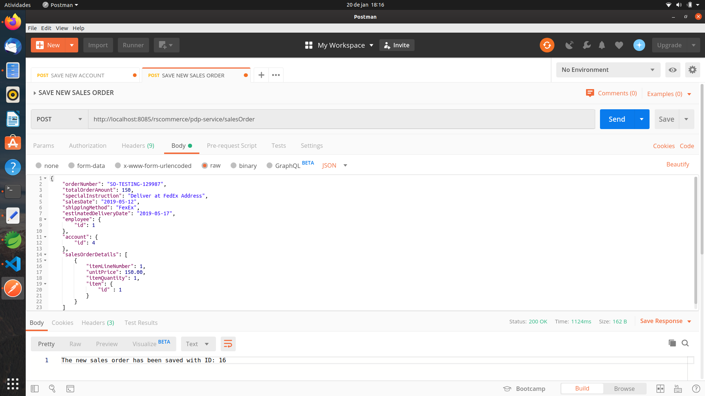

# Spring Boot Microservice Messaging with RabbitMQ and AWS SQS - Part 2

## Reference Documentation

This project is a summary to the second part of Binit Datta's course at Udemy. It is based primarily on the references below:

* [Spring Boot 2 Microservice Messaging in RabbitMQ and AWS SQS](https://www.udemy.com/course/spring-boot-2-messaging-with-rabbitmq-activemq-and-aws-sqs/)

* [Part 4: RabbitMQ Exchanges, routing keys and bindings](https://www.cloudamqp.com/blog/2015-09-03-part4-rabbitmq-for-beginners-exchanges-routing-keys-bindings.html)

### Features

These are the key features that we'll cover in this project:

        * Spring Boot 2.x

        * RabbitMQ Fanout Publisher/Consumers Applications

### Description

In this project, we use RabbitMQ to send the same message from a Producer to two Consumers, using the RabbitMQ Fanout Exchange and Queues. So, in this case, we have three applications: one Producer/Sender and two Consumers; all complete separate to demonstrate the use case.

### RabbitMQ Fanout Application Architecture

As a User, we invoke the Sales Order Controller, which is a Spring REST Controller API, that will invoke the Sales Order Service, which is autowired. Then, Sales Order Repository will persist Sales Order data into our local MySQL database.

As we said, sending messages should not be synchronously done. So, we are using a Sales Order Event Listener here, which is asynchronous.

After that, Sales Order Message Sender sends Sales Order data to a Fanout Exchange. This Exchange is bound to two Queues: fulfillment-queue and account-receivable-queue.

So, when we are making a sell, multiple departments are interested in the sell; these are the two departments: one is the Finance Department and the other is the Fulfillment Department, which actually ships the products. Therefore, they are receiving the same message and they are saving on their own data stores.

### RabbitMQ Concepts - Fanout Exchange

A Fanout Exchange copies and routes a received message to all queues that are bound to it regardless of routing keys or pattern matching as with Direct and Topic Exchanges. The keys provided will simply be ignored.

Fanout Exchanges can be useful when the same message needs to be sent to one or more queues with consumers who may process the same message in different ways.

As an example, a message received by an exchange would be copied and routed to all three queues bound to that exchange. It could be Sport or Weather updates that should be sent out to each connected mobile device when something happens, for instance.

### Developing the Producer Microservice Application

In the Producer Microservice Application, SalesOrderController is a Spring REST Controller class for the creation of a Sales Order.

            1. @PostMapping("/salesOrder")
            2. public ResponseEntity<?> createSalesOrder(@RequestBody SalesOrder salesOrder) {
            3.      LOG.info("Entered in method createSalesOrder");
            4.      SalesOrder savedSalesOrder = this.salesOrderService.save(salesOrder);
            5.      LOG.info("Called salesOrderService.save: " + savedSalesOrder.toString());
            6.      SalesOrderDTO sosDto = this.salesOrderService.getSalesOrder(savedSalesOrder.getId());
            7.      LOG.info("salesOrderService.getSalesOrder: " + sosDto.toString());
            8.      SalesOrderEvent salesOrderCreatedEvent = new SalesOrderEvent(this, "SalesOrderCreatedEvent", sosDto);
            9.      LOG.info("Created an instance of SalesOrderEvent");
            10.     this.eventPublisher.publishEvent(salesOrderCreatedEvent);
            11.     LOG.info("Published an event with the object salesOrderCreatedEvent");
            12.     return ResponseEntity.ok().body("The new sales order has been saved with ID: " + savedSalesOrder.getId());
            13. }

In the snippet code from above, a Sales Order object is persisted in the local MySQL database. Then, we retrieve this newly created Sales Order record from the database and store that into a DTO object. Afterwards, at line 8, a POJO Event object is instantiated passing in the event name (SalesOrderCreatedEvent) and the DTO object to its constructor.

Then, at line 10, we publish this event to the Spring framework, passing in the event POJO object.

After that, the SalesOrderEventListener class receives the event and processes it.

            1. @EventListener
            2. public void onApplicationEvent(SalesOrderEvent salesOrderEvent) {
            3.     LOG.info("Received Sales Order Event: {} ", salesOrderEvent.getEventType());
            4.     LOG.info("Received Sales Order from Sales Order Event: {} ", salesOrderEvent.getSalesOrderDTO().toString());
            5.     LOG.info("Sales Order created with ID: " + salesOrderEvent.getSalesOrderDTO().getOrderNumber()
            6.             + " and Total Order Amount: " + salesOrderEvent.getSalesOrderDTO().getTotalOrderAmount());
            7.     LOG.info("Printing Sales Order Details Data before sending message: " + salesOrderEvent.getSalesOrderDTO());
            8.     this.salesOrderMessageSender.sendMessage(rabbitTemplate, salesOrderExchangeName, salesOrderRoutingKey,
            9.             salesOrderEvent.getSalesOrderDTO());
            10. }

In the snippet code from above, at line 8 we are calling the sendMessage method from the SalesOrderMessageSender class to send data to the RabbitMQ broker. We should notice that the Exchange name and the Routing Key that we defined in the application.yml property file are being passed in as well, howerver, the Routing Key will be ignored by the Fanout Exchange type.

            spring:
            rabbitmq:
                host: localhost
                port: 5672
                username: guest
                password: guest

            sales-order:
            exchange:
                name: sales-order-exchange
            routing:
                key: sales-order-routing-key

Finally, the SalesOrderMessageSender class message is responsible for sending the message, as we can see in the snippet code below.

            1. public void sendMessage(RabbitTemplate rabbitTemplate, String salesOrderExchange, String salesOrderRoutingKey, Object salesOrderData) {
            2. 	LOG.info("Sending message to the Sales Order Exchange, Message = {} ", salesOrderData);
            3. 	rabbitTemplate.convertAndSend(salesOrderExchange, salesOrderRoutingKey, salesOrderData);
            4. 	LOG.info("The Sales Order Message was sent");
            5. }

### Developing the Fanout Finance Consumer Microservice Application

In the Finance Consumer application, the SalesOrderRabbitMQMessageConsumerListener class is responsible for consuming the message through a method called receiveMessageForFinanceConsumerFromSalesProducer, which has to be annotated with @RabbitListener.

In this way, the method receives a message from a queue named as account-receivable-queue and processes it, that is, retrieves Account Receivable data and saves it into its local data store.

            @RabbitListener(queues = "${account-receivable.queue.name}")
            public void receiveMessageForFinanceConsumerFromSalesProducer(final SalesOrderDTO salesOrderDTO) {
                LOG.info("Received message from Sales Order Producer Application: " + salesOrderDTO.toString());
                try {
                    this.retrievedDataForAccountReceivable(salesOrderDTO);
                } catch (Exception e) {
                    LOG.error("Exception occurred during message receipt and processing: " + e.getLocalizedMessage());
                    throw new AmqpRejectAndDontRequeueException(e);
                }
            }

            private void retrievedDataForAccountReceivable(SalesOrderDTO salesOrderDTO) {
                String transactionNumber = "TRNSLS" + salesOrderDTO.getOrderNumber();
                Long accountId = salesOrderDTO.getAccount().getId();
                Long userId = salesOrderDTO.getAccount().getUser().getId();
                Long salesOrderId = salesOrderDTO.getId();
                Date transactionDate = salesOrderDTO.getSalesDate();
                BigDecimal transactionAmount = salesOrderDTO.getTotalOrderAmount();
                Long salesRepId = salesOrderDTO.getEmployee().getId();
                AccountReceivable accountReceivable = new AccountReceivable(transactionNumber, accountId, userId, salesOrderId,
                        transactionDate, transactionAmount, salesRepId);
                this.accountReceivableService.save(accountReceivable);
            }

### Developing the Fanout Fulfillment Consumer Microservice Application

In the Fulfillment Consumer application, a class named as SalesOrderRabbitMQMessageConsumerListener is responsible for consuming the message as well, but through a method called retrievedDataForFulfillmentAndSave, which is annotated with @RabbitListener.

In this way, the method receives a message from a queue named as fulfillment-queue and processes it, that is, retrieves Fulfillment data and saves it into its local data store.

            @RabbitListener(queues = "${fulfillment.queue.name}")
            public void receiveMessageForFinanceConsumerFromSalesProducer(final SalesOrderDTO salesOrderDTO) {
                LOG.info("Received message from Sales Order Producer Application: " + salesOrderDTO.toString());
                try {
                    this.retrievedDataForFulfillmentAndSave(salesOrderDTO);
                } catch (Exception e) {
                    LOG.error("Exception occurred during message receipt and processing: " + e.getLocalizedMessage());
                    throw new AmqpRejectAndDontRequeueException(e);
                }
            }

            private void retrievedDataForFulfillmentAndSave(SalesOrderDTO salesOrderDTO) {
                String fulfillmentNumber = "FULFILLMENT-" + salesOrderDTO.getOrderNumber();
                String orderNumber = salesOrderDTO.getOrderNumber();
                String specialInstruction = salesOrderDTO.getSpecialInstruction();
                String shippingMethod = salesOrderDTO.getShippingMethod();
                Date estimatedDeliveryDate = salesOrderDTO.getEstimatedDeliveryDate();
                ItemMaster item = salesOrderDTO.getItem();
                String itemUpcCode = item.getItemUPCCode();
                String itemName = item.getItemName();
                Integer itemQuantity = salesOrderDTO.getItemQuantity();
                String color = item.getItemColor();
                String size = item.getItemSize();
                String shippedBy = item.getShippedBy();
                Address address = salesOrderDTO.getAddress();
                String shippingAddress = salesOrderDTO.getAccount().getUser().getFirstName() + " "
                        + salesOrderDTO.getAccount().getUser().getLastName() + " " + address.getHouseNumber() + " "
                        + address.getStreetAddress() + " " + address.getCity() + " " + address.getState() + " "
                        + address.getZipCode();
                Fulfillment fulfillment = new Fulfillment(fulfillmentNumber, orderNumber, specialInstruction, shippingMethod,
                        estimatedDeliveryDate, itemUpcCode, itemName, itemQuantity.toString(), color, size, shippedBy,
                        shippingAddress);
                this.fulfillmentService.save(fulfillment);
            }

    

## Testing the RabbitMQ Producer and Consumers Microservice Applications

### Steps to Test the Eureka Server Microservice Application

These are the steps to run the Service Discovery Eureka Server:

            1. Open a terminal window

            2. cd rollingstone-ecommerce-eureka-service-discovery

            3. mvn clean install

            4. java -jar target/rollingstone-ecommerce-eureka-service-discovery-1.0.jar

            5. Navigate: http://localhost:8761/

We should see the Eureka Monitoring Console.

### Steps to Test the Config Server Microservice Application

These are the steps to run the Spring Cloud Config Server:

            1. Open another new terminal window

            2. cd rollingstone-ecommerce-remote-config-service

            3. gradle clean build

            4. java -jar build/libs/rollingstone-ecommerce-remote-config-service-1.0.jar

            5. Navigate to test: http://localhost:9000/rollingstone-ecommerce-rabbitmq-fanout-finance-api-consumer/mysql

            6. Navigate to test: http://localhost:9000/rollingstone-ecommerce-rabbitmq-fanout-fulfillment-api-consumer/mysql

Then we should see the Fanout Fulfillment and Finance Consumer Application configuration properties in in the browser in a JSON format.

### Steps to Test the Producer Microservice Application

These are the steps to run the Producer Microservice:

            1. Open another new terminal window.

            2. cd rollingstone-ecommerce-rabbitmq-fanout-sales-order-api-producer

            3. gradle clean build -x test

            4. java -jar -Dspring.profiles.active=mysql build/libs/rollingstone-ecommerce-rabbitmq-fanout-sales-order-api-producer-1.0.jar

We should see the Producer registration in the Eureka Monitoring Web Console.

### Steps to Test the Finance Consumer Microservice Application

These are the steps to run the Finance Consumer Microservice:

            1. Open another new terminal window.

            2. cd rollingstone-ecommerce-rabbitmq-fanout-finance-api-consumer

            3. gradle clean build -x test

            4. java -jar -Dspring.profiles.active=mysql build/libs/rollingstone-ecommerce-rabbitmq-fanout-finance-api-consumer-1.0.jar

We should see the Finance Consumer Microservice registration into the Eureka Monitoring Web Console as well.

### Steps to Test the Fulfillment Consumer Microservice Application

These are the steps to run the Finance Consumer Microservice:

            1. Open another new terminal window.

            2. cd rollingstone-ecommerce-rabbitmq-fanout-fulfillment-api-consumer

            3. gradle clean build -x test

            4. java -jar -Dspring.profiles.active=mysql build/libs/rollingstone-ecommerce-rabbitmq-fanout-fulfillment-api-consumer-1.0.jar

We should see the Fulfillment Consumer Microservice registration into the Eureka Monitoring Web Console as well.

### Steps to Test Both the Producer and Consumers Microservice Applications

            1. Open the Postman REST Client.

            2. Enter the url: http://localhost:8085/rscommerce/pdp-service/salesOrder

            2. Select POST as HTTP Method.

            3. Select the Body Tab.

            4. Enter
                {
                    "orderNumber": "SO-TESTING-129987",
                    "totalOrderAmount": 150,
                    "specialInstruction": "Deliver at FedEx Address",
                    "salesDate": "2019-05-12",
                    "shippingMethod": "FexEx",
                    "estimatedDeliveryDate": "2019-05-17",
                    "employee": {
                        "id": 1
                    },
                    "account": {
                        "id": 4
                    },
                    "salesOrderDetails": [
                        {
                            "itemLineNumber": 1,
                            "unitPrice": 150.00,
                            "itemQuantity": 1,
                            "item": {
                                "id" : 1
                            }
                        }
                    ]
                }

            5. Click Send.

            6. Check if we are getting the HTTP 200 Success

            7. Check the Console of the Applications

                a. Sales Order Producer
-

    2020-01-20 17:48:04.546  INFO 4474 --- [nio-8085-exec-2] c.r.aspects.RestControllerAspect         : All method calls invoke this general aspect method
    2020-01-20 17:48:04.553  INFO 4474 --- [nio-8085-exec-2] c.r.s.controller.SalesOrderController    : Entered in method createSalesOrder
    2020-01-20 17:48:04.958  INFO 4474 --- [nio-8085-exec-2] c.r.s.controller.SalesOrderController    : Called salesOrderService.save: SalesOrder [id=16, orderNumber=SO-TESTING-129987, totalOrderAmount=150.0, specialInstruction=Deliver at FedEx Address, salesDate=Sat May 11 21:00:00 BRT 2019, shippingMethod=FexEx, estimatedDeliveryDate=Thu May 16 21:00:00 BRT 2019, employee=Employee [id=1, employeeNumber=null, employeeName=null, firstName=null, lastName=null, sex=null, employeeType=null, startDate=null, addresses=[], contacts=[]], account=Account [id=4, accountNumber=null, accountName=null, user=null, addresses=[]]]
    2020-01-20 17:48:04.958  INFO 4474 --- [nio-8085-exec-2] c.r.s.service.SalesOrderServiceImpl      : Inside getSalesOrder
    2020-01-20 17:48:05.276  INFO 4474 --- [nio-8085-exec-2] c.r.s.controller.SalesOrderController    : salesOrderService.getSalesOrder: SalesOrderDTO [id=16, orderNumber=SO-TESTING-129987, totalOrderAmount=150.0, specialInstruction=Deliver at FedEx Address, shippingMethod=FexEx, estimatedDeliveryDate=2019-05-16 21:00:00.0, itemQuantity=1, employee=Employee [id=1, employeeNumber=null, employeeName=null, firstName=null, lastName=null, sex=null, employeeType=null, startDate=null, addresses=[], contacts=[]], salesDate=2019-05-11 21:00:00.0, account=Account [id=4, accountNumber=null, accountName=null, user=User [id=1, firstName=Steve, lastName=Smith, sex=null, memberType=null, accountNumber=null, registrationDate=null], addresses=[]], address=Address [id=null, houseNumber=cb-151, streetAddress=cb block, city=salt lake city, state=ut, zipCode=87235, account=null, employee=null], user=null, item=ItemMaster [id=0, itemSKUCode=null, itemUPCCode=i-upc-23456, itemName=philip mixer, description=null, itemShortDescription=null, dimention=null, itemSize=12 inch, itemColor=black, manufacturer=null, itemProducer=null, productOf=null, shippedBy=abc inc], salesOrderDetails=[]]
    2020-01-20 17:48:05.277  INFO 4474 --- [nio-8085-exec-2] c.r.s.controller.SalesOrderController    : Created an instance of SalesOrderEvent
    2020-01-20 17:48:05.279  INFO 4474 --- [nio-8085-exec-2] c.r.listeners.SalesOrderEventListener    : Received Sales Order Event: SalesOrderCreatedEvent 
    2020-01-20 17:48:05.279  INFO 4474 --- [nio-8085-exec-2] c.r.listeners.SalesOrderEventListener    : Received Sales Order from Sales Order Event: SalesOrderDTO [id=16, orderNumber=SO-TESTING-129987, totalOrderAmount=150.0, specialInstruction=Deliver at FedEx Address, shippingMethod=FexEx, estimatedDeliveryDate=2019-05-16 21:00:00.0, itemQuantity=1, employee=Employee [id=1, employeeNumber=null, employeeName=null, firstName=null, lastName=null, sex=null, employeeType=null, startDate=null, addresses=[], contacts=[]], salesDate=2019-05-11 21:00:00.0, account=Account [id=4, accountNumber=null, accountName=null, user=User [id=1, firstName=Steve, lastName=Smith, sex=null, memberType=null, accountNumber=null, registrationDate=null], addresses=[]], address=Address [id=null, houseNumber=cb-151, streetAddress=cb block, city=salt lake city, state=ut, zipCode=87235, account=null, employee=null], user=null, item=ItemMaster [id=0, itemSKUCode=null, itemUPCCode=i-upc-23456, itemName=philip mixer, description=null, itemShortDescription=null, dimention=null, itemSize=12 inch, itemColor=black, manufacturer=null, itemProducer=null, productOf=null, shippedBy=abc inc], salesOrderDetails=[]] 
    2020-01-20 17:48:05.280  INFO 4474 --- [nio-8085-exec-2] c.r.listeners.SalesOrderEventListener    : Sales Order created with ID: SO-TESTING-129987 and Total Order Amount: 150.0
    2020-01-20 17:48:05.280  INFO 4474 --- [nio-8085-exec-2] c.r.listeners.SalesOrderEventListener    : Printing Sales Order Details Data before sending message: SalesOrderDTO [id=16, orderNumber=SO-TESTING-129987, totalOrderAmount=150.0, specialInstruction=Deliver at FedEx Address, shippingMethod=FexEx, estimatedDeliveryDate=2019-05-16 21:00:00.0, itemQuantity=1, employee=Employee [id=1, employeeNumber=null, employeeName=null, firstName=null, lastName=null, sex=null, employeeType=null, startDate=null, addresses=[], contacts=[]], salesDate=2019-05-11 21:00:00.0, account=Account [id=4, accountNumber=null, accountName=null, user=User [id=1, firstName=Steve, lastName=Smith, sex=null, memberType=null, accountNumber=null, registrationDate=null], addresses=[]], address=Address [id=null, houseNumber=cb-151, streetAddress=cb block, city=salt lake city, state=ut, zipCode=87235, account=null, employee=null], user=null, item=ItemMaster [id=0, itemSKUCode=null, itemUPCCode=i-upc-23456, itemName=philip mixer, description=null, itemShortDescription=null, dimention=null, itemSize=12 inch, itemColor=black, manufacturer=null, itemProducer=null, productOf=null, shippedBy=abc inc], salesOrderDetails=[]]
    2020-01-20 17:48:05.280  INFO 4474 --- [nio-8085-exec-2] c.r.listeners.SalesOrderMessageSender    : Sending message to the Sales Order Exchange, Message = SalesOrderDTO [id=16, orderNumber=SO-TESTING-129987, totalOrderAmount=150.0, specialInstruction=Deliver at FedEx Address, shippingMethod=FexEx, estimatedDeliveryDate=2019-05-16 21:00:00.0, itemQuantity=1, employee=Employee [id=1, employeeNumber=null, employeeName=null, firstName=null, lastName=null, sex=null, employeeType=null, startDate=null, addresses=[], contacts=[]], salesDate=2019-05-11 21:00:00.0, account=Account [id=4, accountNumber=null, accountName=null, user=User [id=1, firstName=Steve, lastName=Smith, sex=null, memberType=null, accountNumber=null, registrationDate=null], addresses=[]], address=Address [id=null, houseNumber=cb-151, streetAddress=cb block, city=salt lake city, state=ut, zipCode=87235, account=null, employee=null], user=null, item=ItemMaster [id=0, itemSKUCode=null, itemUPCCode=i-upc-23456, itemName=philip mixer, description=null, itemShortDescription=null, dimention=null, itemSize=12 inch, itemColor=black, manufacturer=null, itemProducer=null, productOf=null, shippedBy=abc inc], salesOrderDetails=[]] 
    2020-01-20 17:48:05.340  INFO 4474 --- [nio-8085-exec-2] o.s.a.r.c.CachingConnectionFactory       : Attempting to connect to: [localhost:5672]
    2020-01-20 17:48:05.439  INFO 4474 --- [nio-8085-exec-2] o.s.a.r.c.CachingConnectionFactory       : Created new connection: rabbitConnectionFactory#599f571f:0/SimpleConnection@55b69b47 [delegate=amqp://guest@127.0.0.1:5672/, localPort= 51274]
    2020-01-20 17:48:05.477  INFO 4474 --- [nio-8085-exec-2] c.r.listeners.SalesOrderMessageSender    : The Sales Order Message was sent
    2020-01-20 17:48:05.478  INFO 4474 --- [nio-8085-exec-2] c.r.s.controller.SalesOrderController    : Published an event with the object salesOrderCreatedEvent
    2020-01-20 17:48:05.478  INFO 4474 --- [nio-8085-exec-2] c.r.aspects.RestControllerAspect         : This Aspect method is called only on Sales Order Save

We can see in the logging lines from above that the Sales Order was successfully saved into the local MySQL database and that a Sales Order Message was sent to the RabbitMQ broker.

                b. Finance Consumer

-

    2020-01-20 17:48:05.531  INFO 4832 --- [cTaskExecutor-1] alesOrderRabbitMQMessageConsumerListener : Received message from Sales Order Producer Application: SalesOrderDTO [id=16, orderNumber=SO-TESTING-129987, totalOrderAmount=150.0, specialInstruction=Deliver at FedEx Address, shippingMethod=FexEx, estimatedDeliveryDate=Thu May 16 21:00:00 BRT 2019, itemQuantity=1, employee=Employee [id=1, employeeNumber=null, employeeName=null, firstName=null, lastName=null, sex=null, employeeType=null, startDate=null, addresses=[], contacts=[]], salesDate=Sat May 11 21:00:00 BRT 2019, account=Account [id=4, accountNumber=null, accountName=null, user=User [id=1, firstName=Steve, lastName=Smith, sex=null, memberType=null, accountNumber=null, registrationDate=null], addresses=[]], address=Address [id=null, houseNumber=cb-151, streetAddress=cb block, city=salt lake city, state=ut, zipCode=87235, account=null, employee=null], user=null, item=ItemMaster [id=0, itemSKUCode=null, itemUPCCode=i-upc-23456, itemName=philip mixer, description=null, itemShortDescription=null, dimention=null, itemSize=12 inch, itemColor=black, manufacturer=null, itemProducer=null, productOf=null, shippedBy=abc inc], salesOrderDetails=[]]
    2020-01-20 17:48:05.531  INFO 4832 --- [cTaskExecutor-1] c.r.s.AccountReceivableServiceImpl       : This is the save method of AccountReceivableServiceImpl
    2020-01-20 17:48:05.531  INFO 4832 --- [cTaskExecutor-1] c.r.s.AccountReceivableServiceImpl       : Account Model Received from Sales Order Producer: AccountReceivable [id=null, transactionNumber=TRNSLSSO-TESTING-129987, accountId=4, userId=1, salesOrderId=16, transactionDate=Sat May 11 21:00:00 BRT 2019, transactionAmount=150.0, salesRepId=1]

In the logging lines from above we can see that the Sales Order message was successfully received from the Producer Application and that its data is persisted with the Account Receivable service to the Finance data store.

                c. Fulfillment Consumer
-

    2020-01-20 17:48:05.521  INFO 4955 --- [cTaskExecutor-1] alesOrderRabbitMQMessageConsumerListener : Received message from Sales Order Producer Application: SalesOrderDTO [id=16, orderNumber=SO-TESTING-129987, totalOrderAmount=150.0, specialInstruction=Deliver at FedEx Address, shippingMethod=FexEx, estimatedDeliveryDate=Thu May 16 21:00:00 BRT 2019, itemQuantity=1, employee=Employee [id=1, employeeNumber=null, employeeName=null, firstName=null, lastName=null, sex=null, employeeType=null, startDate=null, addresses=[], contacts=[]], salesDate=Sat May 11 21:00:00 BRT 2019, account=Account [id=4, accountNumber=null, accountName=null, user=User [id=1, userName=null, firstName=Steve, lastName=Smith, sex=null, memberType=null, accountNumber=null, registrationDate=null], addresses=[]], address=Address [id=null, houseNumber=cb-151, streetAddress=cb block, city=salt lake city, state=ut, zipCode=87235, account=null, employee=null], user=null, item=ItemMaster [id=0, itemSKUCode=null, itemUPCCode=i-upc-23456, itemName=philip mixer, description=null, itemShortDescription=null, dimention=null, itemSize=12 inch, itemColor=black, manufacturer=null, itemProducer=null, productOf=null, shippedBy=abc inc], salesOrderDetails=[]]
    2020-01-20 17:48:05.522  INFO 4955 --- [cTaskExecutor-1] c.r.service.FulfillmentServiceImpl       : This is the save method of FulfillmentServiceImpl
    2020-01-20 17:48:05.522  INFO 4955 --- [cTaskExecutor-1] c.r.service.FulfillmentServiceImpl       : Fulfillment Model Received from Sales Order Producer: Fulfillment [id=0, fulfillmentNumber=FULFILLMENT-SO-TESTING-129987, orderNumber=SO-TESTING-129987, shippingMethod=Deliver at FedEx Address, shippingNumber=FexEx, estimatedDeliveryDate=Thu May 16 21:00:00 BRT 2019, itemUpcCode=i-upc-23456, itemName=philip mixer, itemQuantity=1, size=black, color=12 inch, shippedBy=abc inc, shippingAddress=Steve Smith cb-151 cb block salt lake city ut 87235]

In the logging lines from above we can see that the Sales Order message was successfully received from the Producer Application and that its data is persisted with the Fulfillment service to the Fulfillment data store.

            8. Check the Database Table

                a. rollingstone_sales_order

-

    mysql> select * from rollingstone_sales_order;
    +----+-------------------+--------------------+--------------------------+------------+-----------------+-------------------------+-------------+------------+
    | id | order_number      | total_order_amount | special_instruction      | sales_date | shipping_method | estimated_delivery_date | employee_id | account_id |
    +----+-------------------+--------------------+--------------------------+------------+-----------------+-------------------------+-------------+------------+
    | 16 | SO-TESTING-129987 | 150.0              | Deliver at FedEx Address | 2019-05-12 | FexEx           | 2019-05-17              |           1 |          4 |
    +----+-------------------+--------------------+--------------------------+------------+-----------------+-------------------------+-------------+------------+
    1 row in set (0.00 sec)

-

                b. rollingstone_sales_order_details
-

    mysql> select * from rollingstone_sales_order_details;
    +----+--------------+------------+---------------+----------------+---------+
    | id | item_line_no | unit_price | item_quantity | sales_order_id | item_id |
    +----+--------------+------------+---------------+----------------+---------+
    | 16 | 1            |     150.00 |             1 |             16 |       1 |
    +----+--------------+------------+---------------+----------------+---------+
    1 row in set (0.00 sec)

-

                c. rollingstone_account_receivable
-

    mysql> select * from rollingstone_account_receivable;
    +----+-------------------------+------------+---------+----------------+------------------+--------------------+--------------+
    | id | transaction_number      | account_id | user_id | sales_order_id | transaction_date | transaction_amount | sales_rep_id |
    +----+-------------------------+------------+---------+----------------+------------------+--------------------+--------------+
    |  5 | TRNSLSSO-TESTING-129987 |          4 |       1 |             16 | 2019-05-12       |             150.00 |            1 |
    +----+-------------------------+------------+---------+----------------+------------------+--------------------+--------------+
    1 row in set (0.00 sec)

-

                d. rollingstone_fulfillment
-

    mysql> select * from rollingstone_fulfillment;
    +----+-------------------------------+-------------------+--------------------------+-----------------+-------------------------+---------------+--------------+---------------+-------+---------+------------+-----------------------------------------------------+
    | id | fulfillment_number            | order_number      | special_instruction      | shipping_method | estimated_delivery_date | item_upc_code | item_name    | item_quantity | size  | color   | shipped_by | shipping_address                                    |
    +----+-------------------------------+-------------------+--------------------------+-----------------+-------------------------+---------------+--------------+---------------+-------+---------+------------+-----------------------------------------------------+
    |  4 | FULFILLMENT-SO-TESTING-129987 | SO-TESTING-129987 | Deliver at FedEx Address | FexEx           | 2019-05-17              | i-upc-23456   | philip mixer |             1 | black | 12 inch | abc inc    | Steve Smith cb-151 cb block salt lake city ut 87235 |
    +----+-------------------------------+-------------------+--------------------------+-----------------+-------------------------+---------------+--------------+---------------+-------+---------+------------+-----------------------------------------------------+
    1 row in set (0.00 sec)

-

            9. Check the RabbitMQ Admin Console for the new Fanout Exchange and Queues

                a. Fanout Exchange: sales-order-exchange

                b. Finance Queue: account-receivable-queue

                c. Fulfillment Queue: fulfillment-queue

